# ChuvAlert - Detector chuva

(Projeto desenvolvido para a disciplina de Técnicas de Programação, utilizando o Qt Creator)

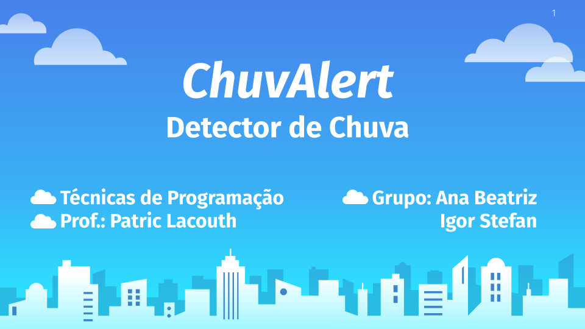

### O que é o ChuvAlert?

O ChuvAlert é um detector de chuva. Um dispositivo que auxilia a protejer a casa de chuva. Tem como objetivo alertar e e fechar janelas da casa quando começa a chover, além disso, o dispositivo pode ser adaptado para mais funções, como por exemplo recolher um varal de roupas limpas.

### Como obter o ChuvAlert?

Se desejar utilizar o software do ChuvAlert, basta fazer o download do repositório e executar o arquivo ChuvAlert.pro com o QT Creator. 

### Como utilizar o ChuvAlert?

A interface do ChuvAlert é bem simples e intuitiva. Em sua tela inicial, além de uma imagem para apresentação da aplicação, temos os seguintes campos: Serial e Estado. Abaixo está algumas dicas para melhorar a sua experiência.

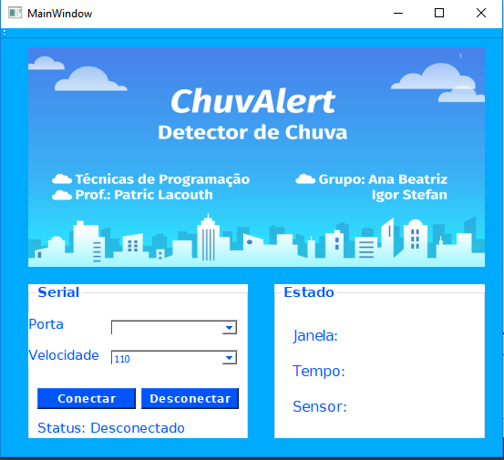

# Manual para utilização do ChuvAlert

Abaixo estão algumas dicas para melhorar a sua experiência.

### 1. Serial/Conexão

Para utilizar o sistema, é fundamental primeiramente fazer a conexão com a ESP presente no circuito eletrônico. Para isto, se faz necessário selecionar a porta USB em que o cabo está localizado através do ComboBox "Porta".

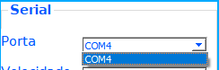
Em seguida, é necessário selecionar a velocidade através do ComboBox "Velocidade".
OBSERVAÇÃO: Para que funcione perfeitamente, selecione a velocidade 115200).

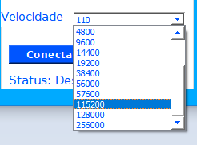

Após selecionar a porta e a velocidade, basta clicar no botão "Conectar" e o Aplicativa estará conectado ao circuito! 
Abaixo dos botões pode ser visto o status da conexão (Conectado -> quando está conectado/ Desconectado -> quando está desconectado).

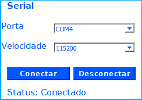

Caso deseje desconectar o Aplicativo do circuito, basta clicar no botão "Desconectar".

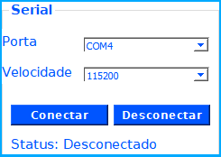

### 2. Estado

Em Estado, é possível observar as informações que o dispositivo fornece. Neste campo serão mostradas três informações essenciais que são atualizadas a cada 0,5 segundos.

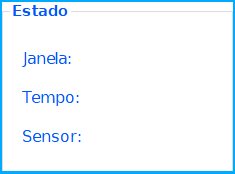

### 2.1 Janela

A primeira informação diz respeito ao estado em que a janela se encontra, ou seja, se a janela estivar aberta aparecerá a mensagem "Janela: Aberta" e se estiver fechada aparecerá "Janela: Fechada". 

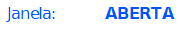

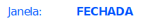

### 2.2 Tempo

A segunda informação diz respeito a como está o tempo no momento, se estivar chovendo aparecerá a mensagem "Tempo: COM CHUVA" e se não estivar chovendo aparecerá "Tempo: SEM CHUVA".

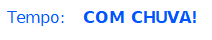

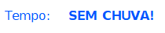

### 2.3 Sensor 

A terceira informação diz respeito ao sensor que está sendo utilizado. Para este tópico, é necessário saber como o sensor está sendo manipulado.

O Sensor de Chuva está sendo utilizado para monitorar a variação da condição climática como gotas de chuva ou de neve do local em que o ChuvAlert for instalado. O funcionamento é bem simples quando o clima está seco a saída do sensor fica em estado alto e quando há uma gota de chuva, a saída fica em estado baixo.

Estado Alto -> 1024
Estado Baixo -> 0

Após testes, foi estabelecido uma faixa para determinar se está chovendo ou não. Se o número que estiver mostrando na aba "Sensor: " for menor que 590, isso quer dizer que está chovendo. Caso seja maior que 590, isso quer dizer que não está chovendo. Podemos ver a lógica na figura abaixo: 

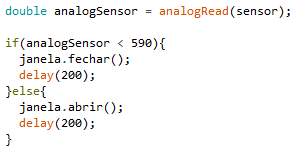

Logo, a interface do Aplicativo ficará assim:

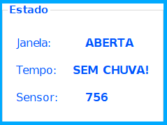

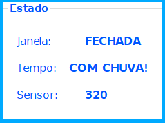

### 3. Funcionamento

Como já foi dito tudo acima, aqui está presente uma foto do protótipo para demonstração do funcionamento do ChuvAlert.

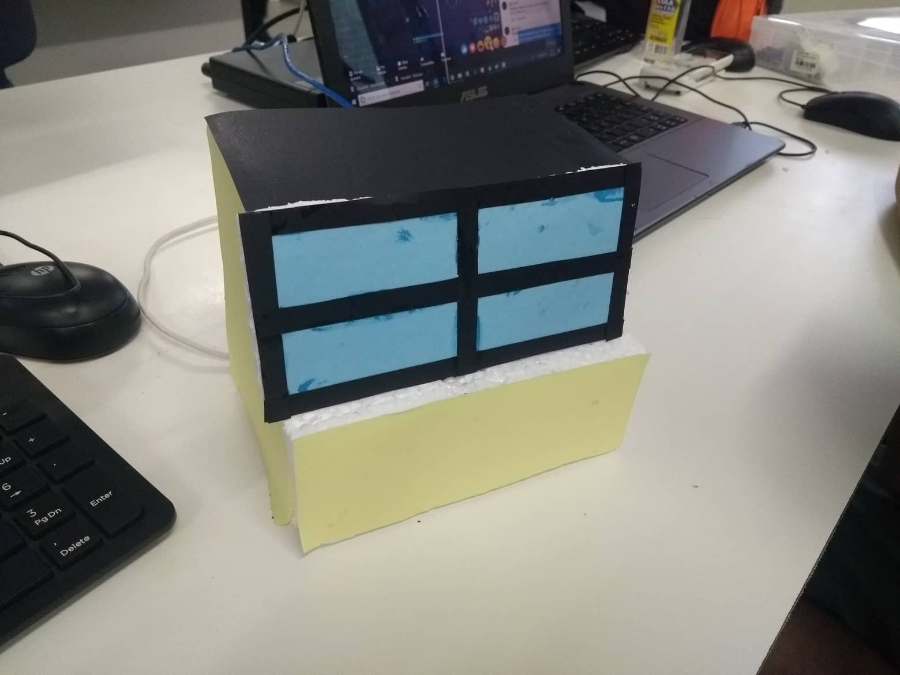
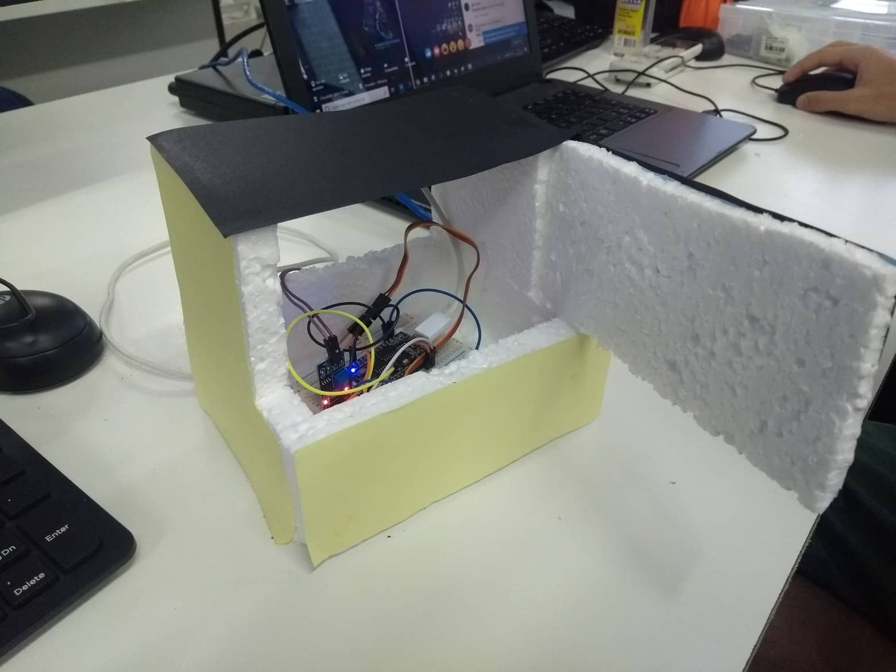

### Agora é só começar a utilizar! :)

Qualquer dúvida, é só entrar em contato com os criadores:

*Ana Beatriz: (83)99650-4471*

*Igor Stefan: (83)98694-3092*

